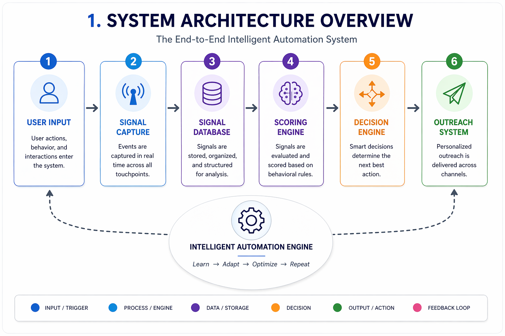

## Overview

The Intelligent Lead System is an automated pipeline that captures, evaluates, and engages leads using data-driven decision-making and agentic automation.

## Why It Matters

Traditional lead handling is manual, inconsistent, and inefficient. This system:

* Eliminates human bottlenecks
* Increases conversion rates
* Enables scalable outreach

## Architecture / Concept

The system is composed of five core layers:

1. Data Layer
2. Scoring Engine
3. Automation Engine
4. Outreach System
5. Agent Layer

Each layer operates independently but communicates through events.

## Implementation

At a high level:

1. Capture lead data
2. Normalize and store
3. Calculate intent score
4. Trigger automation
5. Execute outreach

## Code Example

```typescript
interface Lead {
  email: string
  openedEmails: number
  clickedLinks: boolean
  visitedPricingPage: boolean
}
```

## Diagram (Optional)



## Key Takeaways

* System is modular and event-driven
* Automation replaces manual workflows
* Agents enhance decision-making